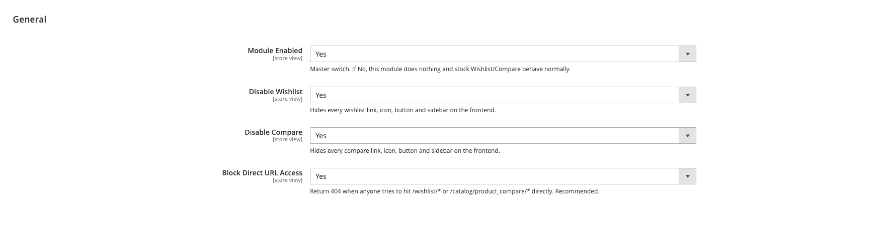

<!-- SEO Meta -->
<!--
  Title: Magento 2 Disable Wishlist and Compare Extension | Hyva + Luma | Panth Infotech
  Description: Completely disable Magento 2 Wishlist and Compare across the entire frontend. Removes every button, link, sidebar, cart row action, customer-account tab, and direct URL route. Works on Hyva and Luma. Admin toggles, no theme edits required. Built by Top Rated Plus Magento developer Kishan Savaliya.
  Keywords: magento 2 disable wishlist, magento 2 disable compare, magento 2 remove wishlist button, magento 2 hide compare, magento 2 remove compare products, hyva disable wishlist, luma disable wishlist, magento 2 disable wishlist extension, magento 2 hide wishlist link, magento 2 wishlist compare module
  Author: Kishan Savaliya (Panth Infotech)
  Canonical: https://kishansavaliya.com/magento-2-disable-wishlist-compare.html
-->

# Magento 2 Disable Wishlist and Compare Extension (Hyva + Luma)

[](https://magento.com)
[](https://php.net)
[](https://www.hyva.io)
[](https://kishansavaliya.com/magento-2-disable-wishlist-compare.html)
[](https://packagist.org/packages/mage2kishan/module-disable-wishlist-compare)
[](https://www.upwork.com/freelancers/~016dd1767321100e21)
[](https://kishansavaliya.com)

> **A single module that removes Wishlist and Compare from every surface of your Magento 2 store.** It covers header icons, product detail buttons, category list buttons, cart row actions, customer account tabs, sidebar blocks, widget links, and direct URL routes. Works on both **Hyva** and **Luma** with no theme edits needed.

**Product page:** [kishansavaliya.com/magento-2-disable-wishlist-compare.html](https://kishansavaliya.com/magento-2-disable-wishlist-compare.html)

---

## Quick Answer

**What is Panth Disable Wishlist and Compare?** It is a Magento 2 extension that gives you a clean admin toggle to remove Wishlist and Compare from every part of the frontend, including all buttons, links, sidebars, and direct URL routes.

**What does it add to my store?**

- A **master on/off switch** in the admin configuration panel.
- **Individual toggles** for Wishlist and Compare so you can disable one or both.
- **Route blocking** that returns a 404 for `/wishlist/*` and `/catalog/product_compare/*` instead of redirecting to a login page.
- **Six separate removal mechanisms** covering layout XML, helper plugins, ViewModel plugins, block plugins, and controller plugins so nothing is left behind.

**Which themes are supported?** Both **Hyva** (Alpine.js) and **Luma**. The right plugins activate automatically based on which theme is in use.

**What does it need?** Magento 2.4.4 to 2.4.8, PHP 8.1 to 8.4, and the free `mage2kishan/module-core` package.

---

## Need Custom Magento 2 Development?

> **Get a free quote for your project in 24 hours** for custom modules, Hyva themes, performance work, M1 to M2 migrations, and Adobe Commerce Cloud.

<p align="center">
  <a href="https://kishansavaliya.com/get-quote">
    
  </a>
</p>

<table>
<tr>
<td width="50%" align="center">

### Kishan Savaliya
**Top Rated Plus on Upwork**

[](https://www.upwork.com/freelancers/~016dd1767321100e21)

100% Job Success - 10+ Years Magento Experience
Adobe Certified - Hyva Specialist

</td>
<td width="50%" align="center">

### Panth Infotech Agency
**Magento Development Team**

[](https://www.upwork.com/agencies/1881421506131960778/)

Custom Modules - Theme Design - Migrations
Performance - SEO - Adobe Commerce Cloud

</td>
</tr>
</table>

**Visit our website:** [kishansavaliya.com](https://kishansavaliya.com) &nbsp;|&nbsp; **Get a quote:** [kishansavaliya.com/get-quote](https://kishansavaliya.com/get-quote)

---

## Table of Contents

- [Who Is It For](#who-is-it-for)
- [Key Features](#key-features)
- [Compatibility](#compatibility)
- [Installation](#installation)
- [Configuration](#configuration)
- [How It Works](#how-it-works)
- [Preview](#preview)
- [FAQ](#faq)
- [Support](#support)
- [About Panth Infotech](#about-panth-infotech)
- [Quick Links](#quick-links)

---

## Who Is It For

- **Single-SKU brands** that sell one product or a tight range and have no use for wish lists or comparisons.
- **B2B and wholesale stores** where buyers purchase on spec sheets, not saved lists.
- **Industrial and trade suppliers** whose customers never use Magento's default wishlist or compare features.
- **Merchants cleaning up the frontend** who want to remove unused UI without touching theme files.
- **Hyva storefronts** that need the compare icon, wishlist icon, and all related ViewModel calls switched off without custom Alpine.js overrides.

---

## Key Features

### Admin Toggles for Everything

- **Master module switch** turns the entire module on or off without uninstalling it.
- **Separate Wishlist and Compare toggles** so you can disable one without touching the other.
- **Block Direct URL Access toggle** forces a 404 on `/wishlist/*` and `/catalog/product_compare/*` instead of a 302 redirect to the login page.
- All settings are available at default, website, and store view scope.

### Complete Wishlist Removal

- **Header wishlist icon** removed on both Hyva and Luma via layout XML.
- **Wishlist sidebar block** removed on Luma.
- **Product detail "Add to Wish List"** removed including related and upsell sections.
- **Category list add-to-wishlist buttons** removed via layout and JS helper override.
- **Cart row "Move to Wishlist"** removed for all product types.
- **Customer account side-nav tab** removed.
- **Luma widget links** cleared by a block plugin on `AbstractProduct::getAddToWishlistUrl()`.
- **Magento Wishlist helper** plugged to return false from `isAllow()` and `isAllowInCart()`.
- **Hyva WishlistViewModel** plugged to return false from `isEnabled()` and `isAllowInCart()`.
- **`/wishlist/*` direct URL routes** return 404 before the auth redirect fires.

### Complete Compare Removal

- **Hyva header compare icon** removed via layout and `show_compare=false` argument.
- **Core compare header link and sidebar** removed on Luma.
- **Product detail "Add to Compare"** removed including related and upsell sections.
- **Category list add-to-compare buttons** removed via layout and JS helper override.
- **Luma widget links** cleared by a block plugin on `AbstractProduct::getAddToCompareUrl()`.
- **Hyva ProductCompare ViewModel** plugged to return false from `showCompareSidebar()`, `showInProductList()`, and `showOnProductPage()`.
- **`/catalog/product_compare/*` routes** return 404 via a controller plugin.

### Hyva and Luma Ready

- **Six separate removal mechanisms** so every rendering path is covered regardless of how a theme emits wishlist or compare markup.
- **Hyva-specific plugins** are harmless on Luma-only stores because Magento's plugin runtime skips them if the target class is never instantiated.
- **No theme file overrides** needed on either theme.

### Built to Last

- **Clean constructor DI** only, no ObjectManager.
- **MEQP-style code** with full compliance with Magento coding standards.
- **Translation ready** with every label using `__()`.

---

## Compatibility

| Requirement | Versions Supported |
|---|---|
| Magento Open Source | 2.4.4, 2.4.5, 2.4.6, 2.4.7, 2.4.8 |
| Adobe Commerce | 2.4.4, 2.4.5, 2.4.6, 2.4.7, 2.4.8 |
| Adobe Commerce Cloud | 2.4.4 to 2.4.8 |
| PHP | 8.1.x, 8.2.x, 8.3.x, 8.4.x |
| Hyva Theme | 1.0+ (fully compatible) |
| Luma Theme | Native support |
| Required Dependency | `mage2kishan/module-core` (free) |

---

## Installation

### Composer Installation (Recommended)

```bash
composer require mage2kishan/module-disable-wishlist-compare
bin/magento module:enable Panth_Core Panth_DisableWishlistCompare
bin/magento setup:upgrade
bin/magento setup:di:compile
bin/magento setup:static-content:deploy -f
bin/magento cache:flush
```

### Manual Installation via ZIP

1. Download the latest release from [Packagist](https://packagist.org/packages/mage2kishan/module-disable-wishlist-compare) or from the [product page](https://kishansavaliya.com/magento-2-disable-wishlist-compare.html).
2. Extract it to `app/code/Panth/DisableWishlistCompare/` in your Magento install.
3. Make sure `Panth_Core` is installed too (required dependency).
4. Run the commands above starting from `bin/magento module:enable`.

### Verify Installation

```bash
bin/magento module:status Panth_DisableWishlistCompare
# Expected: Module is enabled
```

After install, open:
```
Admin -> Stores -> Configuration -> Panth Extensions -> Disable Wishlist & Compare
```

---

## Configuration

Go to **Stores -> Configuration -> Panth Extensions -> Disable Wishlist & Compare**.

| Setting | Group | Default | Description |
|---|---|---|---|
| Module Enabled | General | Yes | Master switch. If No, all runtime plugins are disabled and stock Wishlist/Compare behave normally. |
| Disable Wishlist | General | Yes | Hides every wishlist link, icon, button, and sidebar on the frontend. |
| Disable Compare | General | Yes | Hides every compare link, icon, button, and sidebar on the frontend. |
| Block Direct URL Access | General | Yes | Returns 404 when anyone hits `/wishlist/*` or `/catalog/product_compare/*` directly. |

> **Note on layout removals:** Layout XML removals apply whenever the module is enabled at the CLI level. The admin toggles above control only the runtime plugins and route blocking. To restore the UI while keeping the module installed, disable the module via CLI.

---

## How It Works

The module uses six complementary mechanisms so every rendering path is covered.

1. **Layout XML removes** on `default`, `catalog_product_view`, `catalog_category_view`, `catalog_list_item`, `catalogsearch_result_index`, `catalogsearch_advanced_result`, and `checkout_cart_index`. Every named wishlist and compare block that Magento core and Hyva declare is removed here.
2. **Header argument override** - Hyva's `header.phtml` gates the compare and wishlist icons on `show_compare` and `show_wishlist` arguments of the `header-content` block. Both are forced to `false`.
3. **Helper plugin** on `Magento\Wishlist\Helper\Data::isAllow()` and `isAllowInCart()` forces false so any third-party block that checks the helper drops out silently.
4. **Block plugin** on `Magento\Catalog\Block\Product\AbstractProduct::getAddToCompareUrl()` and `getAddToWishlistUrl()` returns an empty string, which breaks the conditional gates in every Luma widget template without any template overrides.
5. **Hyva ViewModel plugins** on `Hyva\Theme\ViewModel\Wishlist` and `Hyva\Theme\ViewModel\ProductCompare` force all display methods to false.
6. **Route blocking** - a predispatch observer for `controller_action_predispatch_wishlist` runs before the customer session auth redirect, so `/wishlist/*` returns a 404. A controller plugin on `Magento\Catalog\Controller\Product\Compare::execute` blocks compare routes. AJAX and POST requests return a JSON stub so stale JS listeners fail quietly.

### Restoring the UI

**Option A - keep the module, restore UI:**

```bash
bin/magento module:disable Panth_DisableWishlistCompare
bin/magento cache:flush
```

**Option B - uninstall entirely:**

```bash
bin/magento module:disable Panth_DisableWishlistCompare
composer remove mage2kishan/module-disable-wishlist-compare
bin/magento setup:upgrade
bin/magento setup:di:compile
bin/magento cache:flush
```

---

## Preview

### Admin Configuration



*Stores -> Configuration -> Panth Extensions -> Disable Wishlist & Compare - four toggles, all defaulting to Yes, applied immediately after cache flush.*

---

## FAQ

### Does this work on Hyva themes?

Yes. The module ships dedicated Hyva ViewModel plugins for both `Hyva\Theme\ViewModel\Wishlist` and `Hyva\Theme\ViewModel\ProductCompare`, plus the header argument override that removes the icons from the Hyva header. It requires no Alpine.js changes or template overrides.

### Does it work on Luma too?

Yes. Layout XML removals, block plugins, and helper plugins cover every Luma surface including sidebars, widget templates, and cart row actions. The module detects which plugins are needed at runtime.

### What if I only want to disable Wishlist but keep Compare active?

Turn on "Disable Wishlist" and leave "Disable Compare" set to No in the admin. Each feature is controlled by its own toggle.

### Will `/wishlist/` redirect to login instead of showing a 404?

No. The predispatch observer fires before the customer session auth check, so the route returns a proper 404 rather than a 302 redirect to the login page. Set "Block Direct URL Access" to No if you want the routes accessible without the frontend UI.

### Does a third-party module that adds its own wishlist button still show?

The module plugs every Magento core integration point. If a third-party module renders its own button via a custom block that bypasses those points, add a `<referenceBlock name="..." remove="true"/>` in a child theme layout override or open a GitHub issue.

### Does the layout XML apply even when the admin toggle is No?

Layout XML removals are module-level and apply whenever the module is enabled at the CLI. The admin toggles control only the runtime plugins and route blocking. To fully restore the UI, disable the module via `bin/magento module:disable`.

### Does it create any database tables?

No. The module has no database schema. All behavior is handled through plugins, observers, and layout XML.

### Can I use it on a multi-store setup?

Yes. All admin settings are available at default, website, and store view scope, so you can disable wishlist on one store view and leave it active on another.

### Does it need Panth Core?

Yes. `mage2kishan/module-core` is a free required dependency that Composer installs automatically. It provides the shared admin tab and menu parent.

---

## Support

| Channel | Contact |
|---|---|
| Product Page | [kishansavaliya.com/magento-2-disable-wishlist-compare.html](https://kishansavaliya.com/magento-2-disable-wishlist-compare.html) |
| Email | kishansavaliyakb@gmail.com |
| Website | [kishansavaliya.com](https://kishansavaliya.com) |
| WhatsApp | +91 84012 70422 |
| GitHub Issues | [github.com/mage2sk/module-disable-wishlist-compare/issues](https://github.com/mage2sk/module-disable-wishlist-compare/issues) |
| Upwork (Top Rated Plus) | [Hire Kishan Savaliya](https://www.upwork.com/freelancers/~016dd1767321100e21) |
| Upwork Agency | [Panth Infotech](https://www.upwork.com/agencies/1881421506131960778/) |

Response time: 1-2 business days.

### Need Custom Magento Development?

Looking for **custom Magento module development**, **Hyva theme work**, **store migrations**, or **performance tuning**? Get a free quote in 24 hours:

<p align="center">
  <a href="https://kishansavaliya.com/get-quote">
    
  </a>
</p>

<p align="center">
  <a href="https://www.upwork.com/freelancers/~016dd1767321100e21">
    
  </a>
  &nbsp;&nbsp;
  <a href="https://www.upwork.com/agencies/1881421506131960778/">
    
  </a>
  &nbsp;&nbsp;
  <a href="https://kishansavaliya.com/magento-2-disable-wishlist-compare.html">
    
  </a>
</p>

---

## About Panth Infotech

Built and maintained by **Kishan Savaliya** ([kishansavaliya.com](https://kishansavaliya.com)), a **Top Rated Plus** Magento developer on Upwork with 10+ years of eCommerce experience.

**Panth Infotech** is a Magento 2 development agency that builds high quality, security focused extensions and themes for both Hyva and Luma storefronts. The extension suite covers SEO, performance, checkout, product presentation, customer engagement, and store management, with each module built to MEQP standards and tested across Magento 2.4.4 to 2.4.8.

Browse the full extension catalog on our [Magento extensions page](https://kishansavaliya.com/magento-extensions.html) or on [Packagist](https://packagist.org/packages/mage2kishan/).

---

## Quick Links

| Resource | Link |
|---|---|
| **Product Page** | [magento-2-disable-wishlist-compare.html](https://kishansavaliya.com/magento-2-disable-wishlist-compare.html) |
| **Packagist** | [mage2kishan/module-disable-wishlist-compare](https://packagist.org/packages/mage2kishan/module-disable-wishlist-compare) |
| **GitHub** | [mage2sk/module-disable-wishlist-compare](https://github.com/mage2sk/module-disable-wishlist-compare) |
| **Website** | [kishansavaliya.com](https://kishansavaliya.com) |
| **Free Quote** | [kishansavaliya.com/get-quote](https://kishansavaliya.com/get-quote) |
| **Upwork (Top Rated Plus)** | [Hire Kishan Savaliya](https://www.upwork.com/freelancers/~016dd1767321100e21) |
| **Upwork Agency** | [Panth Infotech](https://www.upwork.com/agencies/1881421506131960778/) |
| **Email** | kishansavaliyakb@gmail.com |
| **WhatsApp** | +91 84012 70422 |

---

<p align="center">
  <strong>Want to remove Wishlist and Compare from your store?</strong><br/>
  <a href="https://kishansavaliya.com/magento-2-disable-wishlist-compare.html">
    
  </a>
</p>

---

**SEO Keywords:** magento 2 disable wishlist, magento 2 disable compare, magento 2 remove wishlist button, magento 2 hide wishlist, magento 2 hide compare, magento 2 disable wishlist extension, magento 2 disable compare module, magento 2 remove compare products, hyva disable wishlist, hyva disable compare, luma disable wishlist, luma disable compare, magento 2 wishlist toggle, magento 2 compare toggle, magento 2 disable wishlist compare module, magento 2 remove wishlist link, magento 2 block wishlist url, magento 2 404 wishlist, magento 2 frontend cleanup, magento 2.4.8 disable wishlist, php 8.4 disable wishlist, mage2kishan disable wishlist compare, panth disable wishlist, panth infotech, hire magento developer, top rated plus upwork, kishan savaliya magento, custom magento development
