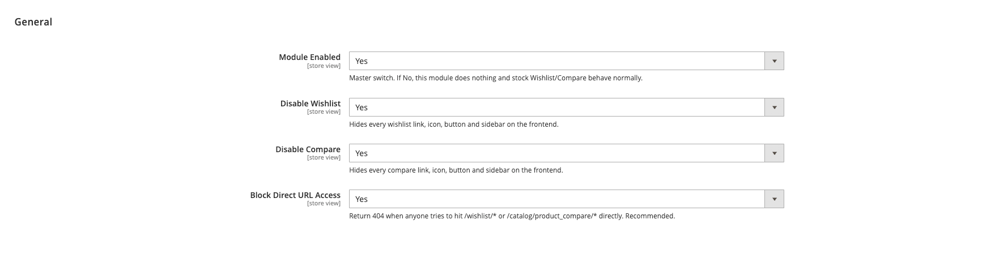

# Magento 2 Disable Wishlist and Compare

Removes the Wishlist and Compare Products features from the Magento 2 storefront. It hides every wishlist and compare link, button, icon and sidebar that Magento and the Hyva theme render, and answers direct requests to `/wishlist/*` and `/catalog/product_compare/*` with a 404. Everything is controlled from the admin configuration, with no theme changes required.

Typical users are stores that sell a small range of products, B2B and wholesale catalogues, and merchants who want to remove unused storefront features cleanly. Works with the Hyva and Luma themes.

Product page: [kishansavaliya.com/magento-2-disable-wishlist-compare.html](https://kishansavaliya.com/magento-2-disable-wishlist-compare.html)

## Features

- Master switch plus separate toggles for Wishlist and Compare, so either feature can be disabled on its own.
- Removes the header wishlist and compare links and icons, the "My Wish List" entry in the Hyva header customer menu, the wishlist and compare sidebars, and the customer account "My Wish List" tab.
- Removes "Add to Wish List" and "Add to Compare" from the product page (including bundle products), and from the related, upsell and cross-sell sections.
- Removes the add-to-wishlist and add-to-compare controls from category listings and search results (Luma and Hyva).
- Removes "Move to Wishlist" from every cart item type (simple, configurable, bundle, grouped, downloadable, virtual).
- Returns 404 for direct requests to `/wishlist/*` and `/catalog/product_compare/*` (optional). AJAX and POST requests receive a small JSON response instead of an error page.
- Settings can be set per default, website or store view scope.
- No database tables, no cron jobs and no console commands.

## Compatibility

| | |
|---|---|
| Magento Open Source / Adobe Commerce | 2.4.4 to 2.4.8 |
| PHP | 8.1, 8.2, 8.3, 8.4 |
| Themes | Hyva and Luma |

The Composer package requires `magento/framework ^103.0`, `magento/module-backend ^102.0`, `magento/module-catalog ^104.0`, `magento/module-config ^101.2`, `magento/module-store ^101.1` and `magento/module-wishlist ^101.0`.

## Requirements

- Magento 2.4.4 or later
- PHP 8.1 to 8.4
- `mage2kishan/module-core` (installed automatically by Composer; provides the shared "Panth Extensions" admin tab and menu)

## Installation

```bash
composer require mage2kishan/module-disable-wishlist-compare
bin/magento module:enable Panth_Core Panth_DisableWishlistCompare
bin/magento setup:upgrade
bin/magento setup:di:compile
bin/magento cache:flush
```

`setup:di:compile` is only needed in production mode. The module ships no static assets, so no static content deployment is required.

Check the result with:

```bash
bin/magento module:status Panth_DisableWishlistCompare
```

## Configuration

Go to **Stores > Configuration > Panth Extensions > Disable Wishlist & Compare**.

| Setting | Default | What it does |
|---|---|---|
| Module Enabled | Yes | Master switch. When set to No the runtime plugins and route blocking are off and stock Wishlist and Compare behave normally. |
| Disable Wishlist | Yes | Hides every wishlist link, icon, button and sidebar on the storefront. |
| Disable Compare | Yes | Hides every compare link, icon, button and sidebar on the storefront. |
| Block Direct URL Access | Yes | Returns 404 when `/wishlist/*` or `/catalog/product_compare/*` is requested directly. |

All four settings are available at default, website and store view scope. Configuration paths: `panth_disable_wc/general/enabled`, `panth_disable_wc/general/disable_wishlist`, `panth_disable_wc/general/disable_compare`, `panth_disable_wc/general/block_routes`.

The layout removals follow these settings: the wishlist blocks are removed only while Module Enabled and Disable Wishlist are both Yes, and the compare blocks only while Module Enabled and Disable Compare are both Yes. Setting Module Enabled to No brings back the stock wishlist and compare UI. Clean the layout and full page caches after changing a setting.



## Usage

Once installed and enabled, nothing else needs to be done: the storefront no longer shows any wishlist or compare controls on Hyva or Luma, and direct links to the wishlist and compare pages return 404 while "Block Direct URL Access" is on.

How it works:

- An observer on `layout_load_before` adds the `panth_disable_wc_wishlist` layout handle when the wishlist is disabled and the `panth_disable_wc_compare` handle when compare is disabled. These handles remove the wishlist and compare blocks that Magento and Hyva declare (header links and icons, the Hyva header customer menu link, sidebars, account tab, product page, category and search listings, cart item actions) and set the Hyva header's `show_wishlist` and `show_compare` arguments to false.
- A plugin on `Magento\Wishlist\Helper\Data` makes `isAllow()` and `isAllowInCart()` return false, so any block that asks the helper before rendering stays hidden.
- A plugin on `Magento\Catalog\Block\Product\AbstractProduct` returns empty add-to-wishlist and add-to-compare URLs, which hides the buttons in Luma widget templates.
- Plugins on `Hyva\Theme\ViewModel\Wishlist` and `Hyva\Theme\ViewModel\ProductCompare` make their display methods return false. On a Luma-only store these classes are never loaded, so the plugins have no effect there.
- An observer on `controller_action_predispatch_wishlist` and plugins on `Magento\Wishlist\Controller\AbstractIndex`, the shared wishlist `Allcart` and `Cart` controllers and `Magento\Catalog\Controller\Product\Compare` turn direct requests into a 404 before the customer login redirect can happen.

If a third-party module renders its own wishlist or compare button through a custom block, remove that block with a `<referenceBlock name="..." remove="true"/>` in your theme's layout, or open an issue on GitHub.

## Developer Notes

- Module name: `Panth_DisableWishlistCompare`
- Composer package: `mage2kishan/module-disable-wishlist-compare`
- PHP namespace: `Panth\DisableWishlistCompare`
- Config helper: `Panth\DisableWishlistCompare\Helper\Config` (`isEnabled()`, `isWishlistDisabled()`, `isCompareDisabled()`, `isRouteBlockingEnabled()`)
- ACL resource for the configuration section: `Panth_DisableWishlistCompare::config`

## Uninstallation

To restore the wishlist and compare UI while keeping the package installed, set Module Enabled to No and clean the caches, or disable the module:

```bash
bin/magento module:disable Panth_DisableWishlistCompare
bin/magento cache:flush
```

To remove the package:

```bash
bin/magento module:disable Panth_DisableWishlistCompare
composer remove mage2kishan/module-disable-wishlist-compare
bin/magento setup:upgrade
bin/magento setup:di:compile
bin/magento cache:flush
```

The module creates no database tables, so nothing is left behind.

## Support

- Product page: [kishansavaliya.com/magento-2-disable-wishlist-compare.html](https://kishansavaliya.com/magento-2-disable-wishlist-compare.html)
- Contact: [kishansavaliya.com/contact](https://kishansavaliya.com/contact)
- Email: kishansavaliyakb@gmail.com
- Bug reports: [GitHub issues](https://github.com/mage2sk/module-disable-wishlist-compare/issues)

## License

Proprietary, as declared in `composer.json`. The package is published on Packagist and can be installed with Composer; see the product page for the terms of use.

## Changelog

See [CHANGELOG.md](CHANGELOG.md).

## Links

- Website: [kishansavaliya.com](https://kishansavaliya.com)
- All extensions: [kishansavaliya.com/magento-extensions.html](https://kishansavaliya.com/magento-extensions.html)
- GitHub: [mage2sk/module-disable-wishlist-compare](https://github.com/mage2sk/module-disable-wishlist-compare)
- Packagist: [mage2kishan/module-disable-wishlist-compare](https://packagist.org/packages/mage2kishan/module-disable-wishlist-compare)
